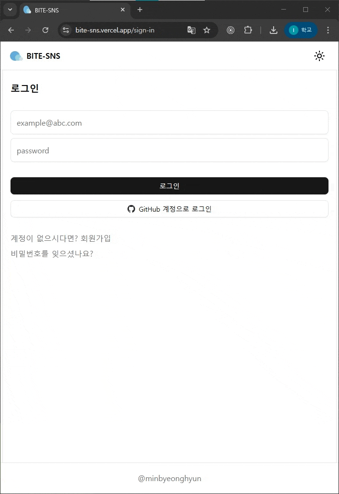

<div align="center">

# BITE-SNS – SNS 플랫폼

나의 일상을 공유할 수 있는 SNS 플랫폼 개발

[구경하기](https://bite-sns.vercel.app/)


</div>

---

## 구현 기능

### 🔐 인증 · 사용자

- Supabase Authentication + GitHub OAuth + 비밀번호 재설정까지 전 플로우 구축
- 최초 로그인 시 랜덤 닉네임/프로필 자동 생성, 프로필 수정 시 스토리지 정리 포함

### 📝 피드 · 상호작용

- 게시글 CRUD + 다중 이미지 업로드/미리보기/삭제, 삭제 시 Storage 경로 정리
- 좋아요 RPC(`toggle_post_like`) + TanStack Query `onMutate`로 낙관적 업데이트
- 무한 스크롤 피드, 중첩 댓글(Tree) + 인라인 수정/답글/삭제 알림 모달

### 🧠 상태 · 캐싱

- Zustand 슬라이스(session/modal/theme)를 커스텀 훅으로 분리해 재사용성 확보
- `zustand/persist`로 라이트/다크/시스템 테마 유지, Skeleton UI로 체감 속도 ↑
- TanStack Query 캐시 전략으로 이미 조회한 게시글/댓글은 재요청 없이 재사용

### 🗄️ 데이터 설계 · 안정성

- 게시글·댓글·좋아요·사용자 테이블 및 FK, RPC 설계로 일관성 확보
- Blob URL 생성/해제 관리로 이미지 미리보기 메모리 누수 방지

---

## 기술 스택

- React 19
- Typescript
- Supabase
- Zustand
- TanStackQuery
- shadcn
- tailwindcss
- react-router
- Vercel 배포

---

## 로컬 실행

```bash
npm install
npm dev
```

---

## 데모


